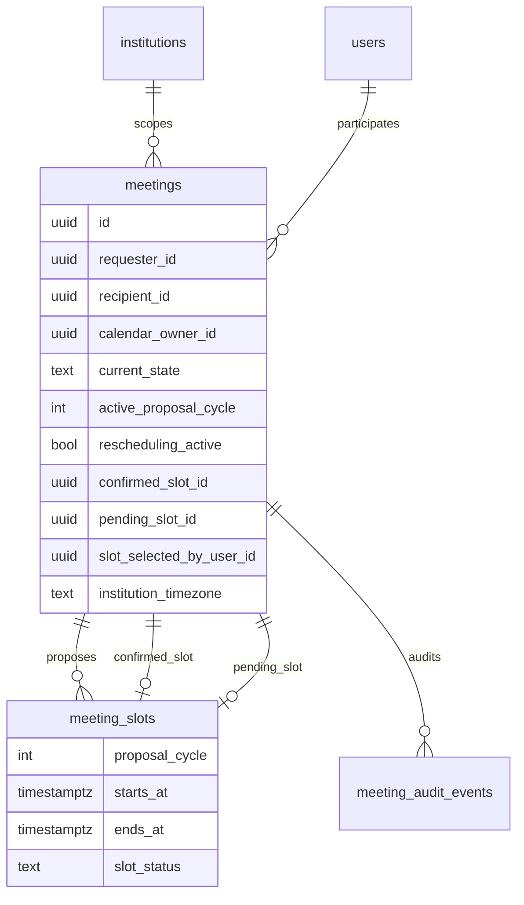
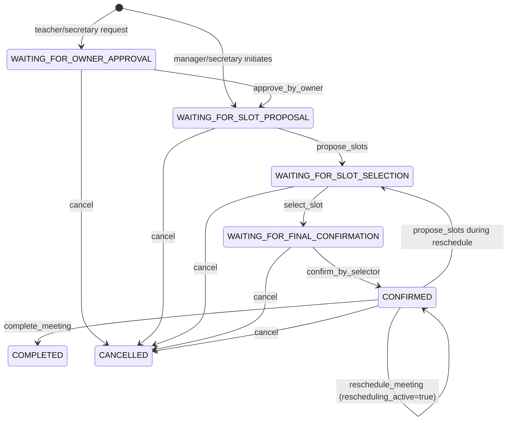

# Meeting Calendar — Phase 1 Validation Report (Architecture Compliance)

## Review status

- Result: **CORRECTED FOR RESUBMISSION**
- Phase 2: **NOT STARTED**
- UI / notifications / reminders / calendar rendering: **NOT INCLUDED**

---

## 1. Updated folder structure

```
supabase/migrations/
  20250713101500_create_auth_user_is_active_secretary_for_institution.sql
  20250713120000_create_meeting_calendar.sql
  20250713130000_reconcile_meeting_calendar_phase1.sql

src/types/meetingCalendar.ts
src/utils/meetingCalendar.ts
src/utils/meetingCalendar.test.ts
src/utils/meetingCalendar.authorization.test.ts
src/services/meetingCalendar.ts
src/services/meetingCalendar.migration.test.ts
docs/meeting-calendar-phase1.md
```

---

## 2. Updated entity diagram



`meetings` is the **authoritative participant source**. The duplicate `meeting_participants` table was removed.

---

## 3. Corrected authorization matrix

### Meeting creation

| Initiator | Recipient | Result |
|---|---|---|
| Teacher | Manager | Allowed |
| Teacher | Secretary | Allowed |
| Secretary | Teacher | Allowed |
| Secretary | Manager | Allowed |
| Manager | Teacher | Allowed |
| Manager | Secretary | Allowed |
| Teacher | Teacher | Denied |
| Secretary | Secretary | Denied |
| Manager | Manager | Denied |

### Slot proposal

| Pair | Authorized proposer |
|---|---|
| Manager + Teacher | Manager |
| Secretary + Teacher | Secretary |
| Manager + Secretary | Manager |

### Slot selection and final confirmation

| Pair | Authorized selector and confirmer |
|---|---|
| Manager + Teacher | Teacher |
| Secretary + Teacher | Teacher |
| Manager + Secretary | Secretary |

### Cancellation

| Pair | Authorized canceller |
|---|---|
| Manager + Teacher | Manager |
| Secretary + Teacher | Secretary |
| Manager + Secretary | Manager |

### Rescheduling

| Pair | Authorized controller |
|---|---|
| Manager + Teacher | Manager |
| Secretary + Teacher | Secretary |
| Manager + Secretary | Manager |

---

## 4. Corrected state diagram



`REQUESTED` and `RESCHEDULING` meeting states were removed.

---

## 5. Calendar-owner derivation rules

Ownership is derived from the **two participant roles**, not from request direction:

1. If either participant is a Manager → Manager is calendar owner.
2. Else if either participant is a Secretary → Secretary is calendar owner.
3. Same-role pairs are rejected before ownership is calculated.

---

## 6. Cancellation matrix

Implemented in `meeting_calendar_cancel_meeting`: only `calendar_owner_id` may cancel from any non-terminal state.

---

## 7. Rescheduling matrix

Implemented in `meeting_calendar_reschedule_meeting`:

- Only calendar owner may initiate.
- Meeting remains `CONFIRMED`.
- `confirmed_slot_id` is preserved.
- `rescheduling_active = true`.
- `active_proposal_cycle` increments.
- Replacement proposals use the new cycle only.

---

## 8. Row-level security policy summary

| Table | Client access |
|---|---|
| `meetings` | `SELECT` for participants only |
| `meeting_slots` | `SELECT` for participants only |
| `meeting_audit_events` | `SELECT` for participants only |

No client `INSERT` / `UPDATE` / `DELETE` grants. Mutations occur only in `SECURITY DEFINER` RPC commands.

---

## 9. Database dependency resolution

Added versioned migration:

`20250713101500_create_auth_user_is_active_secretary_for_institution.sql`

This defines `auth_user_is_active_secretary_for_institution(UUID)` in source control.

---

## 10. Proposal-cycle design

- `meetings.active_proposal_cycle` tracks the current cycle.
- `meeting_slots.proposal_cycle` tags every slot.
- Only slots in the active cycle may be selected.
- Previous-cycle proposal slots are marked `expired` or `superseded`.
- `confirmed_slot_id` remains authoritative until a replacement is confirmed.

---

## 11. Transactional conflict-control design

`meeting_calendar_confirm_meeting` performs, in one command transaction:

1. `SELECT ... FOR UPDATE` on the meeting.
2. State and selector validation.
3. `FOR UPDATE` on the selected slot in the active cycle.
4. Overlap check via `meeting_calendar_participant_has_confirmed_overlap` for both participants.
5. Slot status updates.
6. Meeting confirmation fields update.
7. Audit append.

---

## 12. Audit immutability proof

- `meeting_audit_events` has `BEFORE UPDATE` and `BEFORE DELETE` triggers that always reject mutations.
- Clients receive `SELECT` only; no `INSERT` grant on audit table.
- Audit writes occur only inside `SECURITY DEFINER` command functions.

---

## 13. Positive test names and results

| Test file | Coverage |
|---|---|
| `meetingCalendar.authorization.test.ts` | All 6 allowed creation pairs |
| `meetingCalendar.authorization.test.ts` | Calendar-owner derivation for all 6 directed flows |
| `meetingCalendar.authorization.test.ts` | Slot proposal positives for all 3 participant pairs |
| `meetingCalendar.authorization.test.ts` | Selection/confirmation positives for Teacher and Secretary selectors |
| `meetingCalendar.authorization.test.ts` | Cancellation positives for calendar owners |
| `meetingCalendar.authorization.test.ts` | Rescheduling positives for calendar owners |
| `meetingCalendar.migration.test.ts` | SQL enforcement of compliant schema and commands |

---

## 14. Negative test names and results

| Test file | Coverage |
|---|---|
| `meetingCalendar.authorization.test.ts` | Teacher ↔ Teacher denied |
| `meetingCalendar.authorization.test.ts` | Secretary ↔ Secretary denied |
| `meetingCalendar.authorization.test.ts` | Manager ↔ Manager denied |
| `meetingCalendar.authorization.test.ts` | Non-owner slot proposal denied for every flow |
| `meetingCalendar.authorization.test.ts` | Calendar owner cannot select/confirm |
| `meetingCalendar.authorization.test.ts` | Teacher cannot cancel manager/secretary meetings |
| `meetingCalendar.authorization.test.ts` | Secretary cannot cancel manager meetings |
| `meetingCalendar.authorization.test.ts` | Non-owner cannot reschedule |

---

## 15. Concurrent-confirmation test results

| Test | Result |
|---|---|
| `concurrent final confirmation protection > allows only the first confirmation attempt while pending slot exists` | Pass |
| Migration proof: `meeting_calendar_confirm_meeting` uses `FOR UPDATE` | Pass |

---

## 16. Updated architectural deviations

| Item | Status |
|---|---|
| Dedicated `meeting_audit_events` instead of shared `audit_logs` | Retained, documented |
| Manual `complete_meeting` command in Phase 1 | Retained, idempotent |
| Creator must equal requester | Retained |
| Institution timezone stored on meeting row | Added (`institution_timezone`, UTC storage) |

No unsupported deviations remain open.

---

## 17. Exact migration files changed or added

| File | Action |
|---|---|
| `supabase/migrations/20250713101500_create_auth_user_is_active_secretary_for_institution.sql` | Added |
| `supabase/migrations/20250713120000_create_meeting_calendar.sql` | Replaced with compliant schema and commands |

---

## 18. Confirmation that Phase 2 was not started

No dashboard UI, pending-meeting screens, notifications, reminders, cancellation UI, rescheduling UI, or calendar rendering were added.

---

## Validation commands

| Command | Result |
|---|---|
| `npm run test` | **289/291 passed** (2 unrelated UI timeout flakes); migration tests **19/19** |
| `npm run lint` | **Passed** |
| `npm run build` | **Passed** |
